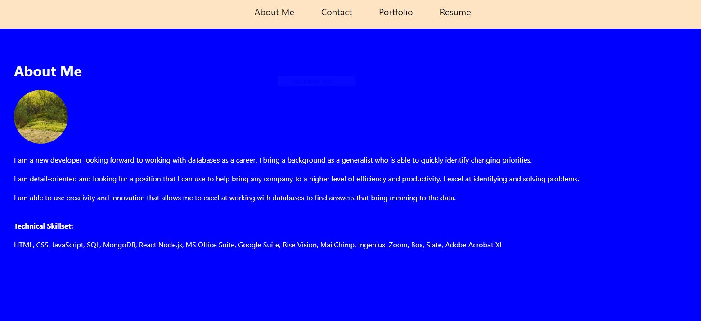

Tracy Torisky Portfolio

ttorisky@gmail.com

Employers are welcome to view my deployed React portfolio to get an overview of who I am, my skillsets, and my deployed projects.

The User is presented with the main page which contains information about who I am, what I am looking for in a career, and what I bring to the table in terms of an effective employee.

The Navigation bar at the top can be used to cycle through this single-page application.

The Contact page contains a form in which the prospective employer is welcome to enter their name, e-mail and comments or questions to send to me.

The Portfolio page has screenshots of previous deployed project with a link to the GitHub repository as well as the deployed projects.

The Resume page gives an overview of my developer skillsets as well as a link to my resume.
